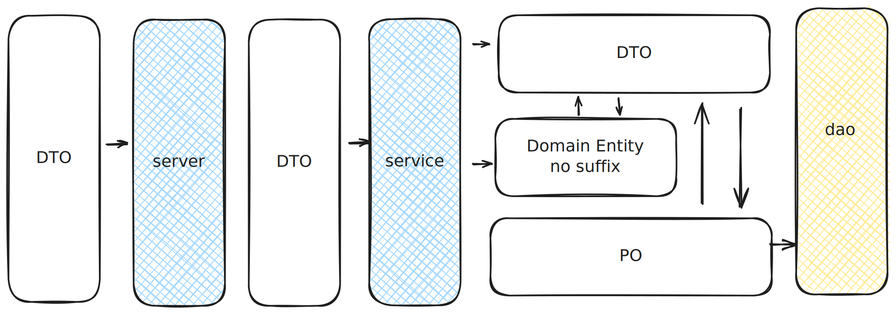

# 后端开发约定

## 编码约定
1. 不提交未排版代码
2. 不提交爆黄代码, 若有不必处理的爆黄块需写清注释
3. 写好方法级别注释

## 风格约定
层级之间允许的入参类型与类型之间允许的转换关系如下

为了使工程中模块定位清晰, 风格明确, 现定义模块与实体职能如下
- server 仅允许出现流程控制代码 
- service 方法中仅仅允许出单一原子化服务功能相关流程控制类型转换相关代码 
- dao 仅允许出现注解方式sql方法 
- entity
   - DTO 层级间系统间信息传输对象, 允许出现与PO实体相互转换代码(PO作为构造函数入参, 或方法返回值)
   - 领域对象无后缀, 允许出现DTO对象间互相转换代码(DTO作为构造函数入参, 或方法返回值), 业务逻辑代码
   - PO 不允许编写构造函数外其他方法

T